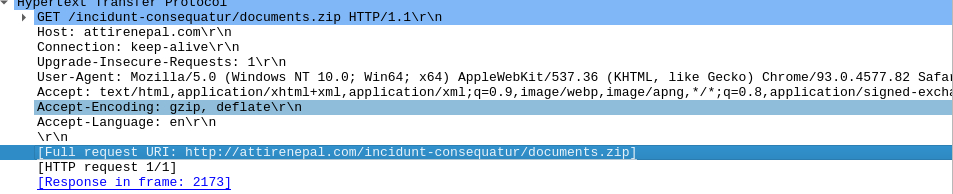
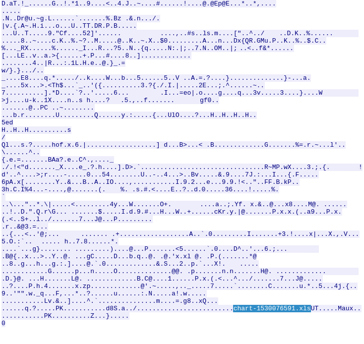

# TryHackMe Carnage CTF writeup

Well it happeend, someone clicked on the "enabled macros" in a malicious document and now it is up to me to figure out what exactly what happened and what the damage is. Time to strap on my thinking pants and get to hunting. This is fine.

# Disclaimer: 
Only one rule: There will be no direct contact with any domain or IP

The first question drops a little hint for us to start, which asks for the date and time the first `HTTP` connection made. Opening up the PCAP file we can see that there is 70,873 packets to go through. I don't know about you, but I am going through that mess manually. Rather, we can use wireshark's filter feature to drill down into what we need to find. In this instance we filter the `HTTP` traffic out from the blob of packets to find the answer in the Layer 2 (Data-Link) "Frame" section. 

Not straying too far from just the first packet of HTTP data, we see that in the info column that the first packet is a `GET` request for the file and our second answer, `documents.zip`. 

Not only was a malicious file being downloaded onto the victim's computer, but we also discovered one of our first IoC (Indicatior of Compromise). The domain `attirenepal[.]com` that was hosting the malicious file. 

Now that we know what and where the malware was being downloading from lets dive further into this packet of data to find what is contained in the zipped up file. Using Wireshark's `Follow HTTP Stream` feature, we can follow the packet and the data contained to find our next answer. 

Note, the answer was at the type of the data stream, but I took the scenic route and discovered the file contained in the zip file at the bottom.

Looks like the victim will be receiving an Excel (.XLS) file named `chart-1530076591.xls` for further infection.

There is numerous ways one can procure information for the next question. For instance, we can use tools like, [Shodan](https://www.shodan.io/) or [CentralOps](https://centralops.net/co/) whois to find what the webserver is running on. However, we can find the webserver information right in the HTTP Stream as well.

Here we can see that the server is running a `LiteSpeed` webserver and utilizing `PHP/7.2.34` as part of its technology stack. Admittedly, the version took me a little bit since I thought the question was looking for the LiteSpeed version, not scripting technology deployed on the webserserver.

Just because the initial infection starts in HTTP, does not mean there might not be traffic utilizing HTTPS. Encryption (TLS) does make it harder to analyze well... anything really, but we can still gather relevant inforamtion. In this case we can use the filter `tls.handshake.extensions_server_name` to weed out any server names the client attempts to start an encrypted tunnel with. Which leads us to add 3 more IoCs.

Looking through the `Client Hello` packets, we find some interesting server names / domains: `finejewels[.]com[.]au, thietbiagt[.]com, new[.]americold[.]com`

For the next question, I just did some quick OSINT work and ran the first domain through CentralOps whois to find `GoDaddy` as the CA. Why? Becuase I like OSINT of course. Afterall, OSINT is classified by the Pentest+, and Security+ as `passive reconaissance` as there is not direct communication with the target.

Once a host is compromised, futher pivoting, and escalation of privileges needs to be conducted. This can be done using post-exploitation tools like `Cobalt Strike`, which facilitates further infection and exploitation of infected networks.

We can use Wirehark's `Conversations` feature to analyze point to point packets to look for any suspicious traffic. In this case, we find two IPs with an unusually large amounts of traffic going to it.

We can use more OSINT to ensure that we have the right IPs `185[.]106[.]96[.]158 and 185[.]125[.]204[.]174` pegged for Cobalt Strike C2 Servers:

Welp, what do you know. we can now add these two IPs to our growing IoC list. Wait a minute, not only those IPs, but those domains `survmeter[.]live and securitybusinpuff[.]com` as well. 

This can also be seen in the PCAP using Wireshark's DNS filter: `dns.a == [Cobalt Strike IP]`. This will search the PCAP DNS `A` records for the IP so we can find our domain(s) being resolved by DNS.

If you recall the first filter search we did with HTTP traffic, there was so much more than just that one packet where we found the malicous zip file and the domain hosting it. In fact, there seems to be a lot of `POST` requests. 

Wireshark has another feature we can use, I know Wireshark is just full of goodies. The feature is used to see any HTTP requests made. 

Looking at the results, we come across a lot of requests being made to this `maldivehost[.]net` domain with a lot of base64 encoded data. However, we do not know if the requests are coming or going (GET OR POST), so let us look at the packets.

Definitely outgoing data being posted to  `/zLIisQRWZI9/[Base64]`. The next three answers is a bit of of a rinse and repeat scenario, so I will be skipping to the question about a certain API being used to caputre IP inforamtion from the victim.

So it seems that the malware is using an API to gather victim IP inforamation, which means they might be using some domain or service to help facilitate this. Back to `dns` filtering. A small amount of elbow grease and we have our the domain `api[.]ipify[.]org` being quried.

What is an attack on a company without the `Delivery` portion of the `Cyber Kill Chain`? Well, numerous of things to be honest, but email continues to be a dominant delivery vector for phishing and malspam campaigns. You know what that means I hope? Yup, another feature. The `smtp` filter. Particularly the filter `smtp.req.parameters` that drills down into certain parameters like `MAIL FROM`. 

We can see a bunch of MAIL FROM parameters, however we are looking for the first one `farshin[@]mailfa[.]com` and the count to smtp protocol packets in total.

Congrats, I think..... We have now identified numerious IoCs and gathered enough information to not only understand what the malware was doing, but can take this one step farther and venture out to identify the exact malware (SquirrelWaffle loader delivering Qakbot in this case) and start other intel processes such as threat attribution and much more. Thanks for reading.